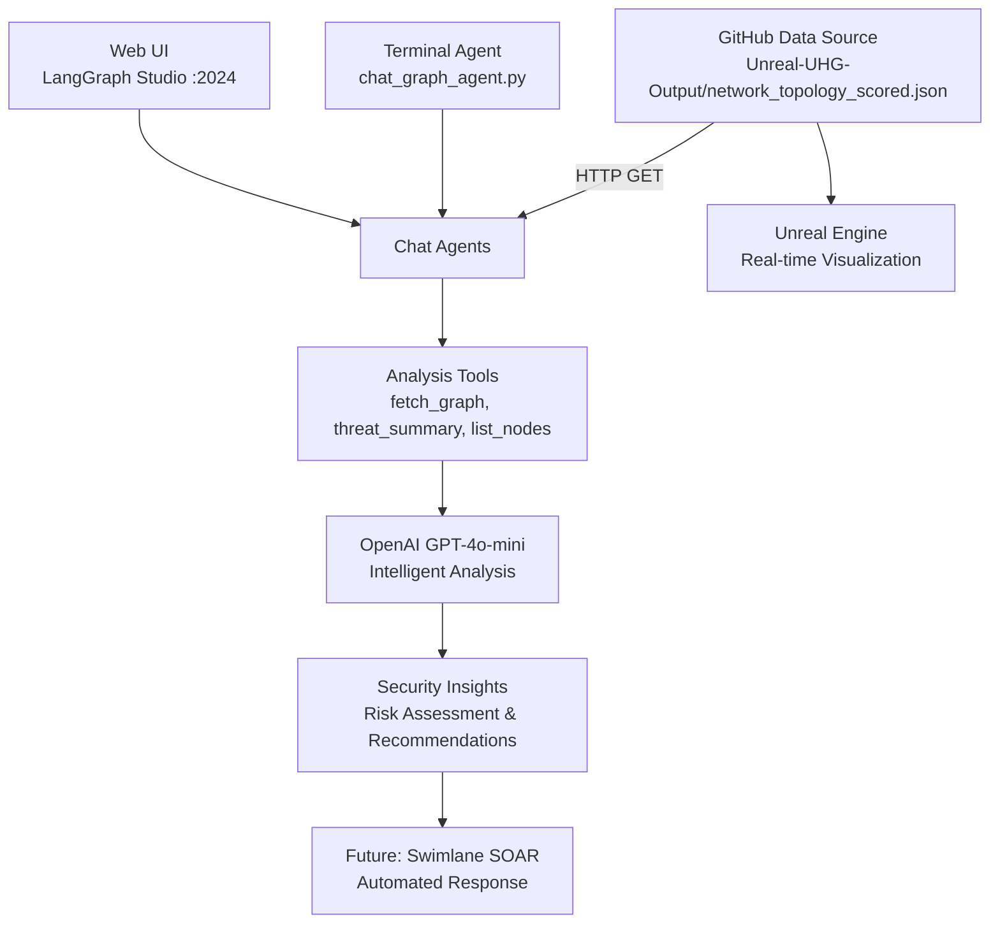

# UHG Cybersecurity Pipeline

🛡️ **Comprehensive cybersecurity analysis platform** with dual chat interfaces for real-time network threat detection and analysis.

## Features

### **🤖 Dual Chat Interfaces**
- **Terminal Agent**: Fast, lightweight command-line interface (`python chat_graph_agent.py`)
- **Web UI**: LangGraph Studio interface at `http://localhost:2024`
- **Identical Capabilities**: Both interfaces provide the same cybersecurity tools

### **🔍 Network Analysis Tools**
- **`fetch_graph`**: Load live network topology from GitHub
- **`threat_summary`**: Comprehensive security analysis with risk distribution
- **`list_nodes`**: Filter nodes by threat status (benign/suspicious/malicious)
- **`node_info`**: Detailed analysis of specific network nodes
- **`list_edges`**: Network connection and traffic analysis

### **🎮 Unreal Engine Integration**
- **Live Data**: Direct access to `https://raw.githubusercontent.com/zbovaird/Unreal-UHG-Output/main/Data/network_topology_scored.json`
- **Delta Tracking**: Real-time change detection for efficient updates
- **Network Clustering**: `network_id` fields for UE organization
- **Version Control**: Node-level versioning for change tracking

### **🔄 Advanced Pipeline (Future)**
- **Automated Scoring**: ML model integration for threat classification
- **SOAR Integration**: Swimlane API for automated response actions
- **Safe Testing**: Isolated test modes for development

## Architecture



## Quick Start

### 1. Setup Environment
```bash
git clone <this-repo>
cd uhg-cyber-pipeline
python -m venv .venv && source .venv/bin/activate
pip install -r requirements.txt
```

### 2. Configure Environment
```bash
# Create .env file with dual-repository configuration
# See instructions.md for complete .env template
```

### 3. Choose Your Interface

#### **Option A: Terminal Chat Agent (Fast)**
```bash
cd my-app
python chat_graph_agent.py
# Interactive terminal interface
```

#### **Option B: Web UI (Full Features)**
```bash
cd my-app
langgraph dev
# Opens web interface at http://localhost:2024
```

### 4. Sample Queries (Both Interfaces)
```
• "fetch the graph" → Load and analyze network data
• "show threat summary" → Comprehensive security overview  
• "list malicious nodes" → High-risk node identification
• "node info node_99" → Detailed node analysis
• "list suspicious nodes with score > 0.7" → Filtered analysis
```

### 5. Advanced Pipeline (Optional)
```bash
python scripts/run_once.py           # dry run
python scripts/run_once.py --commit  # commit results with delta tracking
```

## Repository Links

- **🔧 Pipeline Code**: This repository
- **📊 Data Source**: [Unreal-UHG](https://github.com/zbovaird/Unreal-UHG) (original network topology)
- **📤 Data Output**: [Unreal-UHG-Output](https://github.com/zbovaird/Unreal-UHG-Output) (scored results)
- **🎮 Visualization**: Unreal Engine project consuming the scored JSON data

## Documentation

📖 **[Complete Setup & Usage Guide](instructions.md)** - Detailed documentation with:
- Step-by-step setup instructions
- LangGraph dev server setup and troubleshooting
- Delta tracking system for Unreal Engine
- Configuration options and environment setup
- Development phases roadmap
- Integration details and API testing
